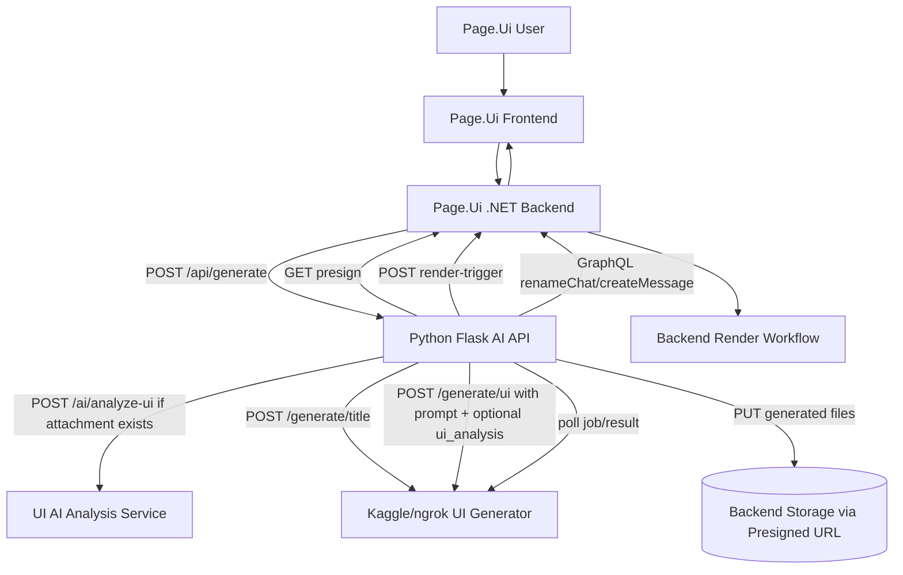

# Page.Ui AI API Service — Project Documentation

> Python Flask Worker · Multi-Agent UI Generation · Page.Ui Integration

---

## 1. Introduction

### Project Name

Page.Ui AI API Service

### Overview

This project is a Python-based AI worker API for the Page.Ui system. It receives generation requests from an existing .NET backend, forwards the user prompt to an external Kaggle/ngrok UI generation service, uploads the generated frontend files through backend-provided presigned upload URLs, and asks the backend to render the result.

The service is intentionally narrow in scope. It does not own users, chats, messages, storage, subscriptions, or rendering state. Those responsibilities remain with the Page.Ui .NET backend. This service preserves the incoming backend-issued bearer token and reuses it when calling backend REST and GraphQL endpoints.

### Purpose

The application solves the problem of connecting Page.Ui chat prompts to a long-running AI UI generation process without blocking the main backend. The `/api/generate` endpoint responds quickly with HTTP `202 Accepted`, while actual generation continues asynchronously in a background event loop.

### Main Goals

- Accept authenticated UI generation requests from the Page.Ui backend.
- Start long-running AI generation jobs without blocking the HTTP request.
- Poll an external Kaggle/ngrok generator until generated UI files are ready.
- Normalize generated files into uploadable artifacts.
- Upload generated files using backend presigned URLs.
- Trigger the backend render workflow.
- Report generation failures back into the chat through backend GraphQL mutations.

### High-Level Feature Summary

- Health endpoint: `GET /health`
- Generation endpoint: `POST /api/generate`
- Render error intake endpoint: `POST /api/report-error`
- Diagnostics-only GraphQL endpoint: `POST /graphql`
- JWT and optional API key request validation
- Kaggle/ngrok UI generation integration with multi-agent pipeline
- Backend GraphQL calls for chat rename and failure messages
- Backend REST calls for file upload presigning and render triggering

---

## 2. User Guide

### Prerequisites

The service expects the following external systems to exist:

- A running Page.Ui .NET backend reachable through `BACKEND_BASE_URL`.
- A backend GraphQL endpoint reachable through `BACKEND_GRAPHQL_URL`.
- A Kaggle/ngrok UI generator reachable through `KAGGLE_API_URL`.
- A UI screenshot analysis service reachable through `UI_AI_SERVICE_URL` when requests include attachments.
- An existing Docker network named `page-ui_page-network` when using `docker-compose.yml`.

Python dependencies are listed in `ai-api/requirements.txt`: `flask`, `strawberry-graphql[flask]`, `httpx`, `python-dotenv`, `PyJWT`.

### Configuration

Configuration is loaded from environment variables. In local development, `python-dotenv` loads values from the root `.env` file.

| Variable | Required | Purpose |
|---|---|---|
| `PORT` | No | Flask port. Defaults to `5000`. |
| `KAGGLE_API_URL` | **Yes** | Base URL for the external UI generation service. |
| `UI_AI_SERVICE_URL` | No | Base URL for the UI screenshot analysis service. Defaults to `http://ui-ai-service:8000`. |
| `UI_AI_ANALYSIS_TIMEOUT_SECONDS` | No | Timeout for screenshot analysis requests. Defaults to `300`. |
| `BACKEND_BASE_URL` | **Yes** | Base URL for backend REST endpoints. Defaults to `http://nginx`. |
| `BACKEND_GRAPHQL_URL` | **Yes** | URL for backend GraphQL calls. |
| `AI_API_KEY` | No | Optional shared secret. Callers must send matching `X-AI-Api-Key`. |
| `JWT_SECRET` | No | Optional JWT signature verification secret. |
| `JWT_ISSUER` | No | Expected JWT issuer. Defaults to `Page.Ui.Worker.Ai`. |
| `JWT_AUDIENCE` | No | Expected JWT audience. Defaults to `AiModelApi`. |
| `JWT_ALGORITHM` | No | JWT algorithm. Defaults to `HS256`. |
| `UI_JOB_START_TIMEOUT_SECONDS` | No | Initial Kaggle generation timeout. Defaults to `60`. |
| `UI_JOB_POLL_INTERVAL_SECONDS` | No | Poll interval for generation jobs. Defaults to `15`. |
| `UI_JOB_TOTAL_TIMEOUT_SECONDS` | No | Total generation timeout. Defaults to `7200` seconds. |
| `UI_JOB_TRANSIENT_POLL_FAILURE_LIMIT` | No | Allowed transient poll failures before failing. Defaults to `20`. |

Do not commit real secret values from `.env`.

### Running with Docker Compose

```bash
# Start the service
docker compose up -d --build ai-api

# View logs
docker compose logs -f ai-api

# Check health
curl http://localhost:5000/health
# → { "status": "ok", "service": "page-ui-ai-api" }
```

### Running Locally Without Docker

```bash
cd ai-api
python -m venv .venv
source .venv/bin/activate        # Linux / macOS
# .venv\Scripts\activate         # Windows
pip install -r requirements.txt
python main.py
```

The service starts on `0.0.0.0:5000` unless `PORT` is set.

### Generation Request

```
POST /api/generate
Authorization: Bearer <backend-issued-token>
Content-Type: application/json
X-AI-Api-Key: <shared-secret>   # only when AI_API_KEY is configured
```

Required JSON fields:

| Field | Purpose |
|---|---|
| `chatId` | Backend chat identifier. |
| `chatKey` | Stable backend chat key used in GraphQL and upload calls. |
| `userStorageKey` | User storage namespace/key. |
| `versionId` | Version identifier for generated files. |
| `triggerMessageId` | Message ID that started the generation. |
| `triggerMessageContent` | User prompt sent to the generator. |

Optional JSON fields:

| Field | Purpose |
|---|---|
| `triggerMessageAttachmentUrl` | Publicly reachable screenshot URL. When present, the worker calls `POST /ai/analyze-ui` on `UI_AI_SERVICE_URL` with `{ "imageUrl": "<url>" }`, then forwards both `attachmentUrl` and `ui_analysis` to the UI generator. |
| `ui_target` | Optional target platform override forwarded to the UI generator. |

Successful response:

```json
{ "accepted": true, "runId": "<uuid>" }
```

### Common Error States

| Condition | Response |
|---|---|
| Missing `Authorization: Bearer` | `401` |
| Invalid `X-AI-Api-Key` | `401` |
| Invalid JWT (when `JWT_SECRET` set) | `401` |
| Missing required payload fields | `400` |
| Missing `KAGGLE_API_URL` | Failure chat message sent |
| Kaggle `502` / `503` / `504` | Retried (transient) |
| Exceeded `UI_JOB_TOTAL_TIMEOUT_SECONDS` | Failure chat message sent |

---

## 3. System Design & Architecture

### Overall Architecture

The service follows a small layered worker architecture:

- **HTTP boundary** — `ai-api/main.py`
- **Authentication** — `ai-api/infrastructure/auth.py`
- **Pipeline orchestration** — `ai-api/ai_pipeline.py`
- **Backend REST gateways** — `storage_gateway.py` and `render_gateway.py`
- **Backend GraphQL gateway** — `graphql_gateway.py`
- **Low-level GraphQL client** — `graphql_client/client.py`
- **External AI generator** — configured by `KAGGLE_API_URL`

- **UI screenshot analysis service** - configured by `UI_AI_SERVICE_URL`

The .NET backend remains the system of record. The Python service acts as a worker that transforms a prompt into generated source files and hands the result back to the backend.

### High-Level System Architecture



### User Flow

```mermaid
flowchart LR
    Start[User submits prompt] --> Backend[Backend stores message]
    Backend --> Generate[Backend calls /api/generate]
    Generate --> Accepted[Python returns 202 + runId]
    Accepted --> Background[Background AI pipeline runs]
    Background --> Upload[Generated files uploaded]
    Upload --> Render[Backend render triggered]
    Render --> Result[User sees rendered UI]
```



### Generation Sequence

```mermaid
sequenceDiagram
    participant Backend as .NET Backend
    participant Flask as Python Flask API
    participant Worker as Background Worker
    participant UIAI as UI AI Analysis
    participant Kaggle as Kaggle/ngrok Generator
    participant Storage as Backend Storage
    participant Render as Backend Render
    participant GraphQL as Backend GraphQL

    Backend->>Flask: POST /api/generate
    Flask->>Flask: Validate API key / JWT / fields
    Flask->>Worker: Submit run_ai_pipeline(token, payload, runId)
    Flask-->>Backend: 202 Accepted + runId
    opt triggerMessageAttachmentUrl exists
        Worker->>UIAI: POST /ai/analyze-ui { imageUrl }
        UIAI-->>Worker: screen_id + elements
    end
    Worker->>Kaggle: Agent 0 – resolve ui_target
    Worker->>Kaggle: Agent 0.5 – generate title
    Worker->>GraphQL: renameChat(title)
    Worker->>Kaggle: Agent 1 – concept JSON
    par Agents 2-4 in parallel
        Worker->>Kaggle: Agent 2 – HTML
        Worker->>Kaggle: Agent 3 – CSS
        Worker->>Kaggle: Agent 4 – JS
    end
    Worker->>Worker: Merge HTML + CSS + JS
    Worker->>Kaggle: Agent 5 – Critic review
    Worker->>Kaggle: Agent 6 – Fixer patches
    Worker->>Storage: GET presign URL
    Storage-->>Worker: uploadUrl + objectKey
    Worker->>Storage: PUT final HTML file
    Worker->>Render: POST /api/ai-dev/render-trigger
    Worker->>Worker: Post – write generation cache
```



### Authentication and Authorization

Authentication is implemented in `ai-api/infrastructure/auth.py`:

1. If `AI_API_KEY` is set, require `X-AI-Api-Key` to match it.
2. Require an `Authorization` header beginning with `Bearer `.
3. Extract the bearer token.
4. If `JWT_SECRET` is set, verify with configured issuer, audience, and algorithm.
5. If `JWT_SECRET` is not set, attempt to decode claims without signature verification for logging only.
6. Return the original token so downstream backend calls can reuse it.

### Backend Boundary

| Backend Endpoint | Called From | Purpose |
|---|---|---|
| `GET /api/ai-dev/upload/presign` | `storage_gateway.get_presigned_url` | Request upload URL and object key for each generated file. |
| `PUT <uploadUrl>` | `storage_gateway.upload_file` | Upload generated file content. |
| `POST /api/ai-dev/render-trigger` | `render_gateway.trigger_render` | Tell the backend to render uploaded files. |
| `POST BACKEND_GRAPHQL_URL` | `graphql_gateway.rename_chat` | Rename chat using generated title. |
| `POST BACKEND_GRAPHQL_URL` | `graphql_gateway.send_message` | Send failure messages to chat. |

### External AI Generator Boundary

| Generator Endpoint | Purpose |
|---|---|
| `POST /generate/title` | Generate a session/app title and optionally detect `ui_target`. |
| `POST /generate/ui` | Start or directly complete UI generation. |
| `GET /generate/ui/{job_id}` or `poll_url` | Poll asynchronous generation status. |
| `GET /generate/ui/{job_id}/result` | Fetch final result when polling does not include files. |

---

## 3.5 Multi-Agent Generation Pipeline

The generation pipeline is composed of eight specialised agents plus one post-processing step. Each agent has a single, well-defined responsibility. Agents 1–4 can short-circuit via a cache lookup, allowing repeat or similar prompts to skip expensive LLM calls.

### Agent Overview

```
Agent 0   (UI Type)   → user selects Web or Mobile
Agent 0.5 (Title)     → generates a 2–4 word session/chat title
Agent 1   (Ideation)  → generates app concept JSON  [CACHE: skip if concept hit]
Agent 2   (HTML)      → semantic, accessible markup  [CACHE: seeded with html_fragment]
Agent 3   (CSS)       → design tokens + Tailwind     [CACHE: seeded with css_tokens]
Agent 4   (JS)        → vanilla JS, event-driven     [CACHE: seeded with js_modules]
Agent 5   (Critic)    → reviews merged output
Agent 6   (Fixer)     → patches flagged issues → final HTML file
Post      (Store)     → saves result to cache
```

### Agent Reference Table

| Agent | Role | Inputs | Outputs / Cache Behaviour |
|---|---|---|---|
| **Agent 0** — UI Type | Platform selector | User gesture | `ui_target: Web \| Mobile`. Propagated to all downstream agents. |
| **Agent 0.5** — Title | Session titler | User prompt | 2–4 word chat title. Sent to `renameChat` via GraphQL. |
| **Agent 1** — Ideation | Concept generator | Prompt + `ui_target` | App concept JSON. **CACHE:** skip entirely if equivalent concept exists. |
| **Agent 2** — HTML | Markup author | Concept JSON + `html_fragment` seed | Semantic, accessible HTML. **CACHE:** seeded with `html_fragment`. |
| **Agent 3** — CSS | Style author | Concept JSON + `css_tokens` seed | Design tokens + Tailwind classes. **CACHE:** seeded with `css_tokens`. |
| **Agent 4** — JS | Logic author | Concept JSON + `js_modules` seed | Vanilla JS modules. **CACHE:** seeded with `js_modules`. |
| **Agent 5** — Critic | Reviewer | Merged HTML + CSS + JS | Structured issue report with severity, location, and suggested fix per item. |
| **Agent 6** — Fixer | Patcher | Issue report + merged output | Final corrected, self-contained HTML file. |
| **Post** — Store | Cache writer | Final HTML file | Writes concept JSON, fragments, tokens, modules, and full file to cache. |

### Agent Descriptions

#### Agent 0 — UI Type Selector

The first gate in the pipeline. The user (or the frontend) selects whether the target UI is **Web** or **Mobile**. The resolved value is stored as `ui_target` and propagated to every downstream agent so that layout, component choices, and breakpoints are appropriate for the platform.

#### Agent 0.5 — Title Generator

Runs in parallel with or immediately after Agent 0. It receives the raw user prompt and returns a concise 2–4 word session title. The title is forwarded to the backend via a GraphQL `renameChat` mutation so the chat list reflects a meaningful name before generation completes.

#### Agent 1 — Ideation Agent

Transforms the user prompt and `ui_target` into a structured app concept expressed as JSON. The concept JSON describes the intended app purpose, key screens, component hierarchy, colour palette intent, and feature list. It acts as the shared specification consumed by Agents 2, 3, and 4.

> **Cache behaviour:** if a concept JSON for an equivalent prompt and target already exists in the generation cache, Agent 1 is skipped entirely and the cached concept is forwarded downstream. This is the primary cache gate.

#### Agent 2 — HTML Agent

Receives the concept JSON and an optional `html_fragment` seed. It produces semantic, accessible HTML markup following WCAG 2.1 AA conventions: correct heading hierarchy, ARIA roles where needed, alt text placeholders, and logical tab order.

> **Cache behaviour:** if a cached `html_fragment` exists it is injected as a seed so the agent only generates the delta rather than the full document.

#### Agent 3 — CSS Agent

Receives the concept JSON and an optional `css_tokens` seed. It produces design tokens (CSS custom properties) and Tailwind utility class annotations covering colour, typography, spacing scale, and responsive breakpoints aligned with `ui_target`.

> **Cache behaviour:** existing `css_tokens` are injected as a seed so previously computed design decisions are preserved and only new tokens are generated.

#### Agent 4 — JavaScript Agent

Receives the concept JSON and an optional `js_modules` seed. It produces vanilla, event-driven JavaScript with no frameworks. Modules cover interactivity, state management, and any API calls implied by the concept JSON. Output is scoped to avoid polluting the global namespace.

> **Cache behaviour:** existing `js_modules` are injected so previously written logic is preserved and only new modules are generated.

#### Agent 5 — Critic Agent

Receives the merged output from Agents 2, 3, and 4. It performs a structured review covering:

- Accessibility violations (missing ARIA, broken heading hierarchy, contrast issues).
- Semantic correctness (invalid HTML nesting, deprecated elements).
- CSS/JS integration issues (undefined Tailwind classes, missing event targets).
- Logical errors in the JavaScript modules.

The Critic produces a machine-readable issue report listing each flagged item with a severity level, the affected code location, and a suggested fix. It does not produce corrected code.

#### Agent 6 — Fixer Agent

Receives both the merged output and the Critic's issue report. It applies targeted patches to resolve each flagged issue. The Fixer outputs a single, self-contained HTML file with inline or co-located CSS and JS. This file is the final generated artifact that enters the upload pipeline.

#### Post — Store Step

After the Fixer produces the final HTML file, the Post step saves the result to the generation cache. It stores the concept JSON, `html_fragment`, `css_tokens`, `js_modules`, and the full file. Subsequent requests with equivalent prompts and targets will hit the cache gates in Agents 1–4 and skip or seed the relevant agents.

### Execution Flow

The pipeline executes in the following order inside `run_ai_pipeline`:

1. **Agent 0** — resolve `ui_target` (Web or Mobile).
2. **Agent 0.5** — generate and persist session title via `renameChat`.
3. **Agent 1** — generate concept JSON or retrieve from cache.
4. **Agents 2, 3, 4** — run in parallel (`asyncio.gather`), each seeded from cache where available.
5. **Merge** — combine HTML, CSS, and JS into a single document.
6. **Agent 5** — review merged output and produce issue report.
7. **Agent 6** — apply patches and produce final HTML file.
8. **Post** — upload final file via presigned URLs, trigger backend render, write cache.

### Cache Strategy

The cache operates at two levels:

**Full cache hit (Agent 1):** if the concept JSON already exists the pipeline from Agent 1 onwards uses cached artifacts as seeds and Agents 2–4 only generate deltas. The Critic and Fixer still run to ensure quality.

**Partial cache hit (Agents 2–4):** individual `html_fragment`, `css_tokens`, or `js_modules` seeds are injected. Only the delta is generated, reducing token usage and latency.

Cache keys are derived from a normalised representation of the user prompt and `ui_target`. Exact key construction and storage backend are defined in the Post step implementation.

### Failure Handling Within the Pipeline

If any agent fails or times out:

- The pipeline catches the exception and calls `graphql_gateway.send_message` to deliver a user-facing failure notification.
- The run is logged with the `run_id` and the failing agent name.
- No partial artifacts are uploaded to avoid a broken render.
- The cache is not written for failed runs.

---

## 4. Implementation Overview

### Main Technologies

- **Python 3.12** — runtime base image in `ai-api/Dockerfile`.
- **Flask** — HTTP API in `main.py`.
- **Strawberry GraphQL** — diagnostics endpoint and manual schema file.
- **httpx** — asynchronous outbound HTTP calls within the pipeline.
- **python-dotenv** — local environment loading.
- **PyJWT** — optional JWT verification and claim decoding.
- **Docker Compose** — local and container runtime orchestration.

### Important Files and Roles

| File / Folder | Purpose |
|---|---|
| `docker-compose.yml` | Service definition, environment defaults, volumes, network, bind mount, dependency installation. |
| `.env` | Environment-specific URLs, optional API key, JWT settings, timeout settings. Secret values must not be committed. |
| `ai-api/Dockerfile` | Python 3.12 slim image definition. |
| `ai-api/requirements.txt` | Python dependency list. |
| `ai-api/main.py` | Active Flask entry point, HTTP routes, background worker loop, diagnostics GraphQL mount. |
| `ai-api/ai_pipeline.py` | Core async AI generation, agent orchestration, polling, normalization, upload, render trigger, failure messaging. |
| `ai-api/diagnostics_graphql/schema.py` | Active `/graphql` diagnostics schema exposing a health query. |
| `ai-api/graphql_api/schema.py` | Manual testing GraphQL schema; not currently mounted by `main.py`. |
| `ai-api/graphql_client/client.py` | Async GraphQL HTTP client used for backend GraphQL calls. |
| `ai-api/graphql_client/enums.py` | Shared enum definitions for message types. |
| `ai-api/graphql_client/mutations.py` | Backend GraphQL mutation strings for creating messages and renaming chats. |
| `ai-api/infrastructure/auth.py` | API key validation, bearer token extraction, optional JWT verification. |
| `ai-api/infrastructure/graphql_gateway.py` | High-level backend GraphQL functions (`send_message`, `rename_chat`). |
| `ai-api/infrastructure/render_gateway.py` | Backend render trigger client. |
| `ai-api/infrastructure/storage_gateway.py` | Backend upload presign client and generated file uploader. |
| `ai-api/infrastructure/urls.py` | URL joining helper supporting absolute and relative paths. |
| `ai-api/model/page-ui-train.ipynb` | Model training/prototyping notebook; not part of service runtime. |
| `ai-api/model/the-model.ipynb` | Model experimentation notebook; not part of service runtime. |

### Generation Pipeline Implementation

The main pipeline function signature is:

```python
async def run_ai_pipeline(token: str, payload: dict[str, Any], run_id: str) -> None
```

Steps in order:

1. Read `KAGGLE_API_URL`, `UI_AI_SERVICE_URL`, and timeout settings.
2. Extract chat, prompt, `ui_target`, reply metadata, and optional `triggerMessageAttachmentUrl` from the payload.
3. If an attachment URL exists, call `POST /ai/analyze-ui` on the UI AI service and add the returned analysis to the `/generate/ui` payload as `ui_analysis`.
4. Resolve `ui_target`.
5. Generate and push the session title.
6. Generate or retrieve concept JSON.
7. Run HTML, CSS, and JS generation concurrently where the generator supports it.
8. Merge HTML, CSS, and JS into a single document.
9. Produce a review issue report.
10. Produce the final HTML file.
11. Normalize the file: basename, content type, UTF-8 bytes.
12. Request a presigned upload URL from the backend.
13. Upload the file with HTTP `PUT`.
14. Trigger backend rendering.
15. Write result to generation cache (Post step).
16. Optionally rename the chat again if the final app title differs from the session title.

### File Normalization

`_normalize_generated_files` accepts generator output shaped as either a `files` array or an `html` string. It normalizes path-like names to basenames, applies content types based on extension, and defaults standalone HTML content to `001-index.html`.

| Extension | Content Type |
|---|---|
| `.html` | `text/html` |
| `.css` | `text/css` |
| `.js` | `application/javascript` |
| other | `mimetypes.guess_type` or `application/octet-stream` |

### Runtime and Concurrency Model

`main.py` creates a global asyncio event loop named `worker_loop` and runs it in a daemon thread. Flask route handlers remain synchronous. When `/api/generate` accepts a request, it schedules `run_ai_pipeline(...)` on the background loop using `asyncio.run_coroutine_threadsafe`.

Individual agent calls within `run_ai_pipeline` are awaitable coroutines, so Agents 2, 3, and 4 are gathered concurrently with `asyncio.gather`.

### Known Limitations and Technical Debt

- No automated tests were found in the repository.
- The active `/graphql` endpoint is diagnostics-only; `graphql_api/schema.py` is unused by `main.py`.
- The Dockerfile depends on Docker Compose's source bind mount for a runnable development container.
- Background jobs are in-process; if Flask restarts, accepted but unfinished jobs are lost.
- Logging uses `print`; structured logs would improve production observability.
- `/api/report-error` only logs render error payloads without forwarding them.
- No queue, retry store, or job status endpoint for accepted `runId` values.
- Agent cache invalidation strategy and storage backend are not yet specified.

### Extension Points

- Add persistent render error forwarding in `/api/report-error`.
- Mount `graphql_api/schema.py` if manual GraphQL generation mutations are required.
- Replace `print` logging with structured JSON logs (e.g. `structlog`).
- Add tests for authentication, agent outputs, file normalization, and timeout handling.
- Add a production Dockerfile path that copies source files into the image.
- Add health checks for backend and Kaggle/ngrok dependencies.
- Implement a distributed cache backend (Redis, S3) for the Post step.
- Add a job status endpoint so callers can query `runId` progress.

---

## Appendix: Folder Structure

```text
D:\PS\api
├── .env
├── docker-compose.yml
└── ai-api/
    ├── Dockerfile
    ├── requirements.txt
    ├── main.py
    ├── ai_pipeline.py
    ├── diagnostics_graphql/
    │   └── schema.py
    ├── graphql_api/
    │   ├── __init__.py
    │   └── schema.py
    ├── graphql_client/
    │   ├── __init__.py
    │   ├── client.py
    │   ├── enums.py
    │   └── mutations.py
    ├── infrastructure/
    │   ├── auth.py
    │   ├── graphql_gateway.py
    │   ├── render_gateway.py
    │   ├── storage_gateway.py
    │   └── urls.py
    └── model/
        ├── page-ui-train.ipynb
        └── the-model.ipynb
```

---

## Maintenance Notes

Update this documentation whenever any public endpoint, required payload field, environment variable, Docker behaviour, backend integration, generator response contract, or agent pipeline step changes.

When modifying `ai-api/ai_pipeline.py`, update the agent overview table and execution flow if agent order or responsibilities change. When adding new agents, add a description entry under Section 3.5 and update the cache strategy notes. When modifying infrastructure gateway modules, update the backend boundary table. When mounting or removing GraphQL schemas, update the User Guide and System Design sections so the documented API surface matches `main.py`.

Keep the appendix current when files are added, removed, or repurposed. If tests are added, document how to run them in the User Guide.
