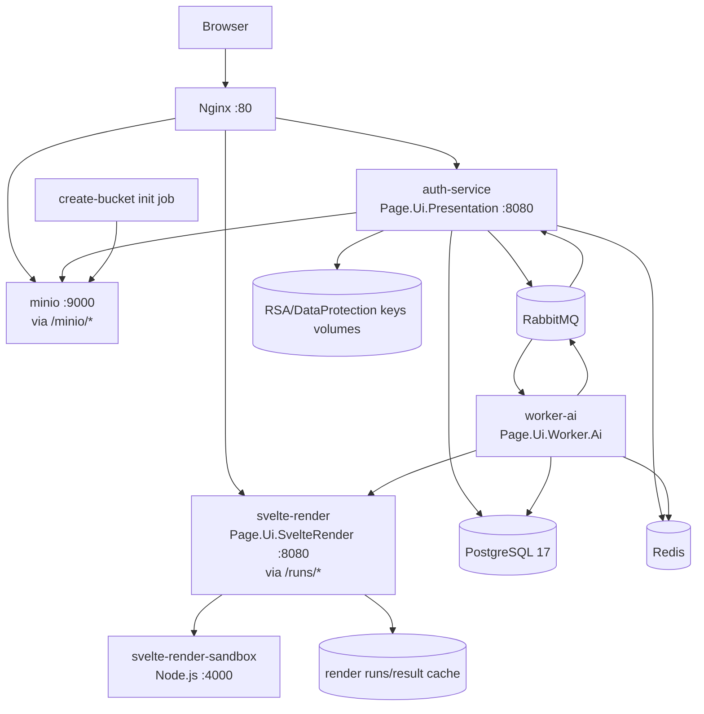
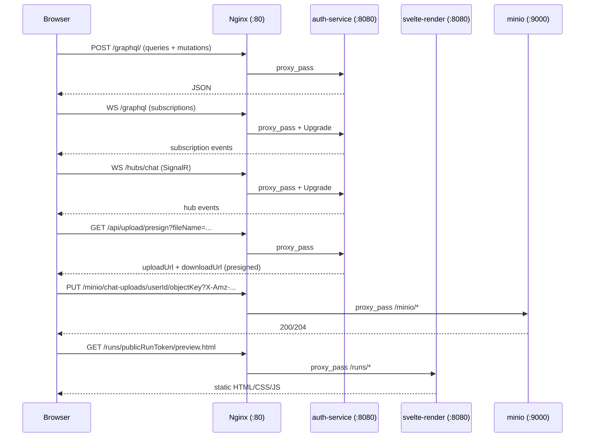
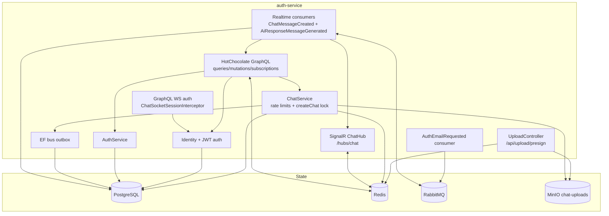
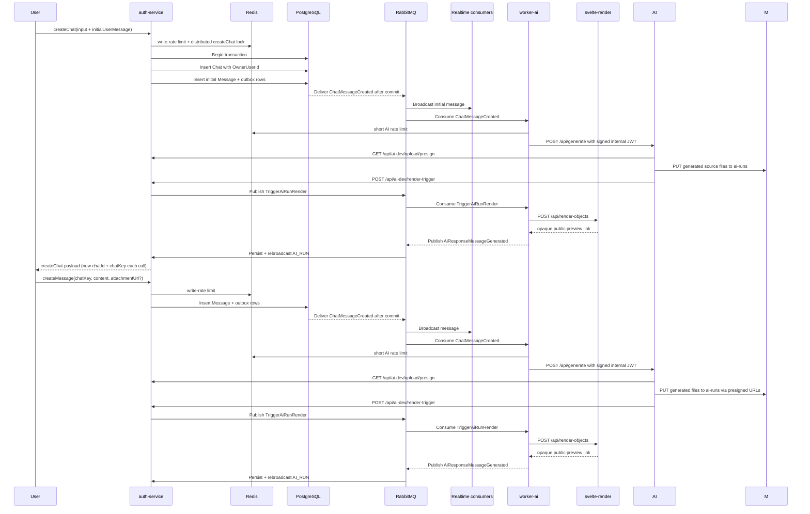
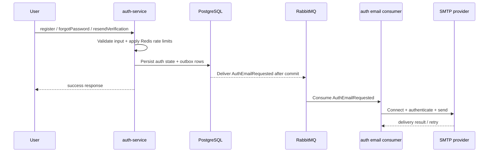
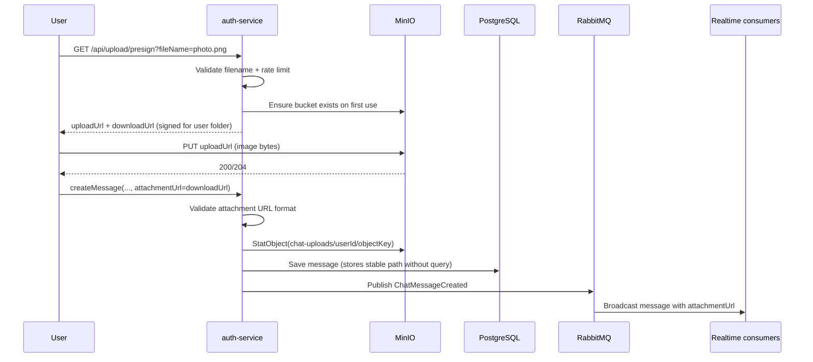
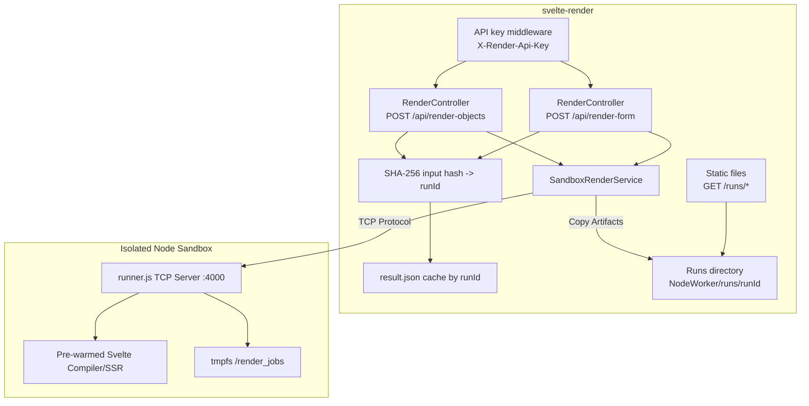
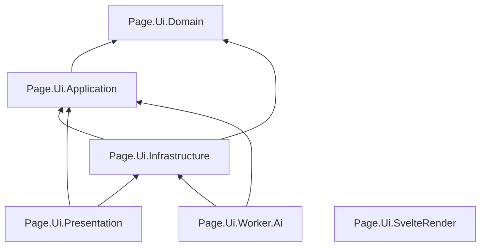

# Page.Ui Backend

[](https://dotnet.microsoft.com/)
[](https://learn.microsoft.com/aspnet/core/)
[](https://learn.microsoft.com/aspnet/core/signalr/introduction)
[](https://graphql.org/)
[](https://chillicream.com/docs/hotchocolate)
[](#)
[](https://www.postgresql.org/)
[](https://redis.io/)
[](https://www.rabbitmq.com/)
[](https://min.io/)
[](https://www.docker.com/)
[](https://nginx.org/)
[](#)
[](#)
[](#)
[](#)

## Repository Structure

Required submission shape:

```text
/src   -> Source code
/exe   -> Executable files, if applicable
README.md
```

Current project source is included in this repository as .NET solution/project directories plus Docker runtime files:

```text
Page.Ui.sln
Page.Ui.Domain/
Page.Ui.Application/
Page.Ui.Infrastructure/
Page.Ui.Presentation/
Page.Ui.Worker.Ai/
Page.Ui.SvelteRender/
docker-compose.yml
nginx.conf
docs/
README.md
```

No pre-built executable is required to run this web application. The supported setup path is source code compilation and Docker Compose deployment.

## Source Code Compilation

This section is the required setup path for running the project from source.

### Prerequisites and Dependencies

Programming languages and runtimes:

- .NET SDK `10.0.x`
- Node.js `20.x` or newer for the Svelte render worker dependencies
- npm, bundled with Node.js

Frameworks and libraries:

- ASP.NET Core / .NET
- Entity Framework Core
- HotChocolate GraphQL
- SignalR
- MassTransit
- Svelte compiler inside the render sandbox
- Tailwind CSS local compiler inside the render worker

Required tools:

- Docker Desktop or Docker Engine with Docker Compose v2
- Git
- PowerShell, Bash, or another shell capable of running Docker and .NET commands

Runtime services started by Docker Compose:

- PostgreSQL `17`
- Redis
- RabbitMQ with management UI
- MinIO
- Nginx
- Page.Ui API service
- Page.Ui AI worker
- Page.Ui Svelte render service
- Page.Ui isolated Node render sandbox

System requirements:

- Windows, macOS, or Linux with Docker support
- Recommended RAM: 8 GB minimum, 16 GB preferred
- Free disk space: at least 5 GB for containers, packages, generated artifacts, and database volumes

External services:

- External AI API is optional for local startup.
- If `AI_MODEL_API_BASE_URL` is empty, the worker uses the configured failure/fallback behavior instead of a real external AI generation service.
- SMTP is only needed for real email delivery flows.

### Installation Steps

1. Clone the repository:

```bash
git clone <repository-url>
cd Page.Ui
```

2. Restore .NET dependencies:

```bash
dotnet restore Page.Ui.sln
```

3. Install Node render worker dependencies:

```bash
cd Page.Ui.SvelteRender/NodeWorker
npm install
cd ../..
```

4. Configure environment values.

For local development, Docker Compose supplies defaults for the internal services. Create or update `.env` only when you need to override defaults such as database passwords, API keys, SMTP, or the external AI API URL.

### Compilation Steps

Build the full .NET solution:

```bash
dotnet build Page.Ui.sln
```

Build containers:

```bash
docker compose build
```

### Run Instructions

Start the full local stack:

```bash
docker compose up --build
```

Start in the background:

```bash
docker compose up --build -d
```

Useful local URLs:

- API / GraphQL: `http://localhost/graphql`
- RabbitMQ management: `http://localhost:15672` (`guest` / `guest`)
- MinIO console: `http://localhost:9001`
- Rendered preview links: `http://localhost/runs/<publicRunToken>/preview.html`

Stop the stack:

```bash
docker compose down
```

### Environment Setup and Configuration

Important environment variables:

```text
DB_PASSWORD                    PostgreSQL password used by compose
MINIO_ACCESS_KEY               MinIO access key, defaults to minioadmin
MINIO_SECRET_KEY               MinIO secret key, defaults to minioadmin
SVELTE_RENDER_API_KEY          internal API key for worker -> renderer
AI_MODEL_API_BASE_URL          optional external AI API base URL
AI_MODEL_API_KEY               optional shared secret sent to the external AI API
AI_INTERNAL_JWT_ISSUER         internal JWT issuer, defaults to Page.Ui.Worker.Ai
AI_INTERNAL_JWT_AUDIENCE       internal JWT audience, defaults to AiModelApi
PAGE_UI_ALLOWED_STYLESHEET_HOSTS optional comma-separated external stylesheet host allowlist
PAGE_UI_TAILWIND_MAX_CSS_BYTES optional generated Tailwind CSS size limit
```

Database setup:

- PostgreSQL is started by Docker Compose.
- Application services are configured to apply EF Core migrations on startup in the local compose setup.
- No separate manual database creation is required for the default local Docker workflow.

Storage setup:

- MinIO is started by Docker Compose.
- Required buckets are created by the compose bucket initialization job and by services when needed.

AI API setup:

- To run with a real external AI API, set `AI_MODEL_API_BASE_URL`.
- The AI API must accept `POST /api/generate`, verify the worker bearer token, upload generated files through `/api/ai-dev/upload/presign`, then call `/api/ai-dev/render-trigger`.
- Generated multi-page HTML may link to local generated CSS/JS files; the renderer resolves those links from the submitted source bundle.
- Tailwind CDN references are stripped and Tailwind CSS is compiled locally by the renderer.

## Pre-Built Executable Setup

No pre-built executable package is currently provided.

This is a Dockerized web application. Use the source-code compilation and Docker Compose instructions above.

If executable artifacts are added later, place them under `/exe` and document:

- download or artifact location;
- installation steps;
- required runtime prerequisites;
- launch command;
- configuration requirements.

## Common Tools and Deployment Platforms

Recommended deployment/build tooling:

- Docker / Docker Compose for local and containerized deployment
- GitHub Actions or GitLab CI for CI/CD
- Container registry for built service images
- Managed PostgreSQL, Redis, RabbitMQ, and S3-compatible object storage for production

Vercel or Netlify are suitable only for separate static/frontend hosting. This backend stack requires containerized services and databases, so the core backend should be deployed on infrastructure that supports long-running containers.

## Implementation Status Snapshot

### Implemented
- AI/chat pipeline now uses:
  - `USER_MESSAGE`
  - `AI_MESSAGE`
  - `THINKING`
  - `AI_RUN`
- message metadata foundation:
  - `Title`
  - `ClientRequestId`
- canonical chat UI versioning:
  - `AiRun`
  - `AiRunFile`
  - current/superseded version state
- MinIO-backed AI source storage in `ai-runs`
- renderer metadata indexing:
  - Postgres source of truth
  - Redis cache/index acceleration
  - raw `input/` files stored with each run
- opaque public run URLs:
  - `/runs/{publicRunToken}/preview.html`
- worker-side signed internal JWT generation for worker -> AI API calls
- AI API integration surface:
  - worker -> AI API `POST /api/generate`
  - `/api/ai-dev/upload/presign`
  - `/api/ai-dev/render-trigger`
- renderer support for multi-page HTML/CSS/JS source bundles with local link resolution
- Tailwind CDN stripping with local Tailwind compilation inside the render sandbox

### Partially implemented / still remaining
- end-to-end validation against a real external AI API that verifies the signed internal JWT
- historical render-run backfill / reconciliation tooling
- broader automated tests for the full worker/storage/renderer flow

## Architecture Diagrams

### 1) Runtime / Container Topology (docker compose)



### 2) Edge Routing + Protocols (Nginx)



### 3) auth-service (Page.Ui.Presentation) Components



### 4) Chat + AI Render Flow (createChat/createMessage + AI callback)



### 5) Auth Email Delivery Flow



### 6) Attachment Upload + Message Validation Flow



### 7) Database Schema

Current chat-related tables after the ownership reshape:

- `AspNetUsers`
- `Chats`
- `Messages`

Chat shape:

- `Chats.OwnerUserId` points to `AspNetUsers.Id`
- `Messages.ChatId` points to `Chats.Id`
- `Messages.SenderId` points to `AspNetUsers.Id`
- `ChatParticipants` is no longer part of the target schema

Other persisted runtime state still includes:

- ASP.NET Identity tables
- refresh/auth tables
- MassTransit outbox/inbox tables

### 8) Chat API Surface

Current chat operations:

- GraphQL queries:
  - `chats`
  - `searchChats`
  - `chat(chatKey)`
  - `messages(chatKey)`
  - `searchMessages(query, chatKey?)`
- GraphQL mutations:
  - `createChat`
  - `createMessage`
  - `renameChat`
  - `deleteChat`
- GraphQL subscription:
  - `onMessageCreated(chatKey)`
- SignalR hub:
  - `JoinChat(chatKey)`
  - `LeaveChat(chatKey)`
- REST:
  - `GET /api/upload/presign`
  - `GET /api/ai-dev/upload/presign`
  - `POST /api/ai-dev/render-trigger`

Pagination and filtered-list guidance:

- chat and message connections use explicit server paging defaults
  - default page size: `20`
  - max page size: `50`
- GraphQL cost analysis is enabled on the API
- for filtered chat lists, prefer `searchChats` over generic `chats(where, order)` unless richer filter composition is specifically required

### 9) Render Service Internals (Page.Ui.SvelteRender)



### 10) Project Layers / Dependencies



## Current Behavior

- Each `createChat` call now creates a new chat with a unique internal `chatId` and a public `chatKey`.
- Each chat belongs to exactly one owner user through `OwnerUserId`.
- `createChat` requires `initialUserMessage`; empty chats are not supported.
- The initial message from `createChat` is saved and published into the same AI response pipeline.
- Chat access checks for GraphQL, subscriptions, and SignalR are owner-based instead of participant-based.
- Chat timestamps are stored in UTC and converted to the configured client-facing timezone at the API/realtime boundary.
- Default chat display timezone is `Africa/Cairo` via `Chat:DisplayTimeZone`.
- Auth email flows (`register`, `forgotPasswordRequest`, `resendVerification`) now enqueue delivery through MassTransit/outbox instead of waiting on SMTP before responding.
- `createMessage` supports `attachmentUrl` and now validates that:
  - URL is absolute
  - URL targets `/minio/chat-uploads/<object>`
  - object exists in MinIO before message persistence
- Stored attachment links are normalized to a stable path (queryless URL).
- `chat-uploads` bucket is private; all uploads and downloads require valid presigned signatures.
- Assets are isolated in user-specific folders within the bucket (e.g., `chat-uploads/{userId}/...`).
- Upload presign requests warm up bucket existence once per service lifetime, then reuse cached confirmation.
- Chat name search now uses PostgreSQL `ILIKE` with a trigram-backed migration instead of `ToLower().Contains(...)`.
- GraphQL subscription access is cached briefly in-process to reduce repeated DB reads on hot subscription streams.
- Users can rename and delete their own chat rooms through GraphQL.
- AI text replies are persisted as `AI_MESSAGE`.
- Final rendered artifact links are persisted as `AI_RUN`.
- Legacy `Text` / `System` types are no longer used in the active AI/chat pipeline.
- Renderer metadata is indexed in Postgres (`RenderRuns`) and cached in Redis.
- Raw renderer inputs are stored with each run under `input/`.
- Public run links now use an opaque token instead of exposing internal storage path segments.
- Worker-generated AI source files are stored in `ai-runs` using versioned source storage; one version is marked current per chat.
- Worker -> AI API calls now prepare a signed internal JWT bearer token for service-to-service authentication.
- External AI APIs receive `POST /api/generate`, upload generated files through `/api/ai-dev/upload/presign`, then call `/api/ai-dev/render-trigger`.
- AI APIs do not need to call GraphQL `createMessage` or `renameChat` for the normal render path.
- Multi-page generated HTML can link to local generated CSS/JS files; the renderer resolves those links from the submitted source bundle.
- Tailwind CDN references are removed and Tailwind CSS is compiled locally when Tailwind classes/directives are detected.
- When the external AI API is unavailable, the worker emits a failure `AI_MESSAGE` and renders the `Model_Error` fallback page through the normal `AI_RUN` pipeline.
- Read-state tracking via `markMessagesRead` is no longer implemented.

## Svelte Rendering Sandbox

The rendering system uses a persistent, isolated sandbox for performance and security.

### 1. Architectural Design
- **Persistent Sandbox Service**: A long-running Node.js service (`svelte-render-sandbox`) handles compilation and SSR.
- **TCP Communication**: The backend communicates with the sandbox over an internal network using TCP port 4000.
- **Protocol**: A binary length-prefixed JSON protocol is used for high-speed data exchange.

### 2. Security & Hardening
- **Stateless Operation**: Uses `tmpfs` for all temporary files; no persistent storage.
- **Filesystem Isolation**: Container runs with `read_only: true`.
- **Privilege Reduction**: Runs as a non-root user with `cap_drop: ALL`.
- **Network Isolation**: Accessible only on the internal `render-internal` bridge.

## Key Runtime Contracts

- Worker -> Render endpoint: `POST /api/render-objects`
- Required worker header: `X-Render-Api-Key`
- Worker config:
  - `SvelteRender__BaseUrl=http://svelte-render:8080`
  - `SvelteRender__ApiKey=<key>`
- Render config:
  - `ServiceAuth__ApiKey=<same key>`
  - `Sandbox__Endpoint=http://svelte-render-sandbox:4000`

## Getting Started

### 1) Start services

```bash
docker compose up --build
```

### 2) Core endpoints

- GraphQL: `http://localhost/graphql`
- RabbitMQ: `http://localhost:15672` (`guest/guest`)
- MinIO Console: `http://localhost:9001`
- Render artifacts: `http://localhost/runs/<publicRunToken>/preview.html`

### 3) Quick behavior check

1. Open GraphQL playground.
2. Run `createChat` with `initialUserMessage.content` and note returned `chat.chatKey` for follow-up calls.
3. Send `createMessage(chatKey: ...)` and confirm broadcast.
4. For images: `GET /api/upload/presign` -> `PUT uploadUrl` -> `createMessage(attachmentUrl=downloadUrl)`.
5. For AI generation, call `createMessage` and confirm:
   - the worker dispatches the prompt to the external AI API with an internal signed JWT
   - the AI API uses `/api/ai-dev/upload/presign` and `/api/ai-dev/render-trigger`
   - `AI_MESSAGE` and `AI_RUN` are later persisted and rebroadcast
