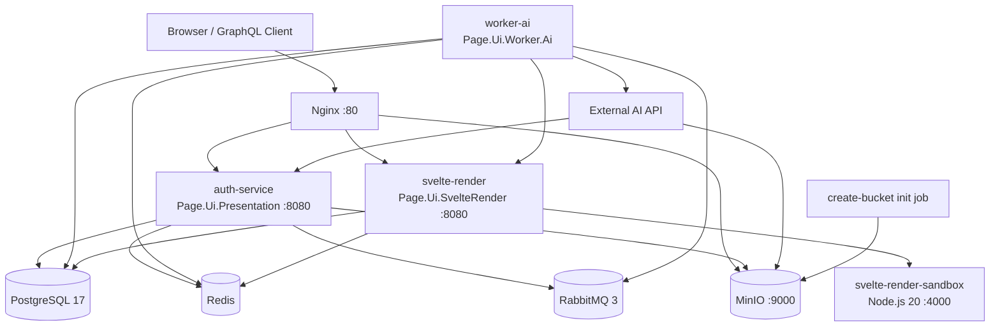
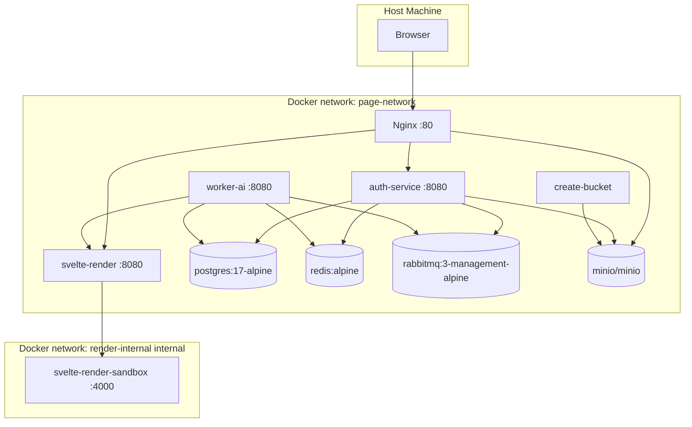
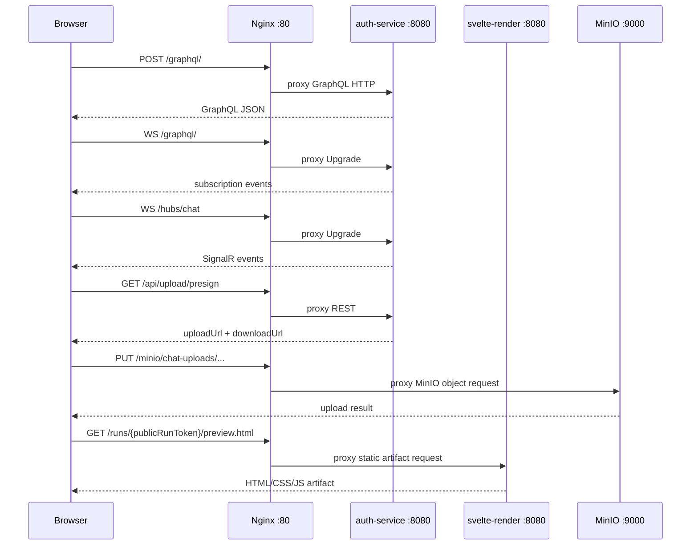
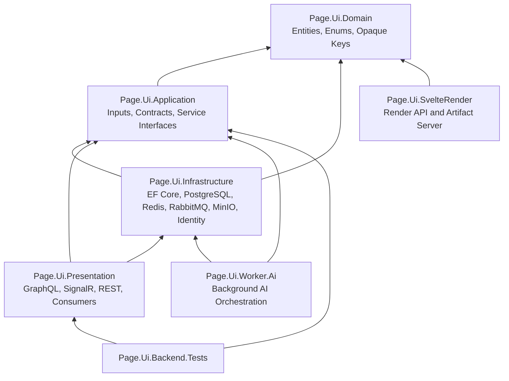
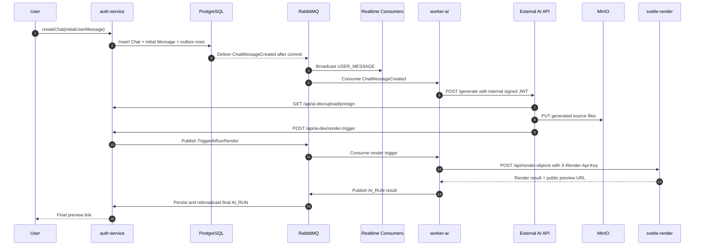
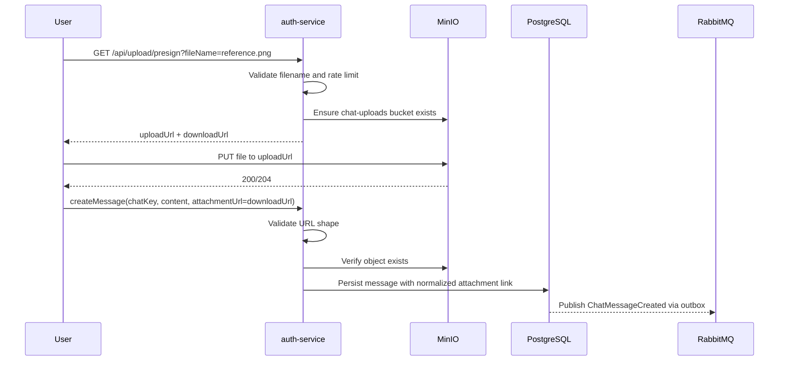
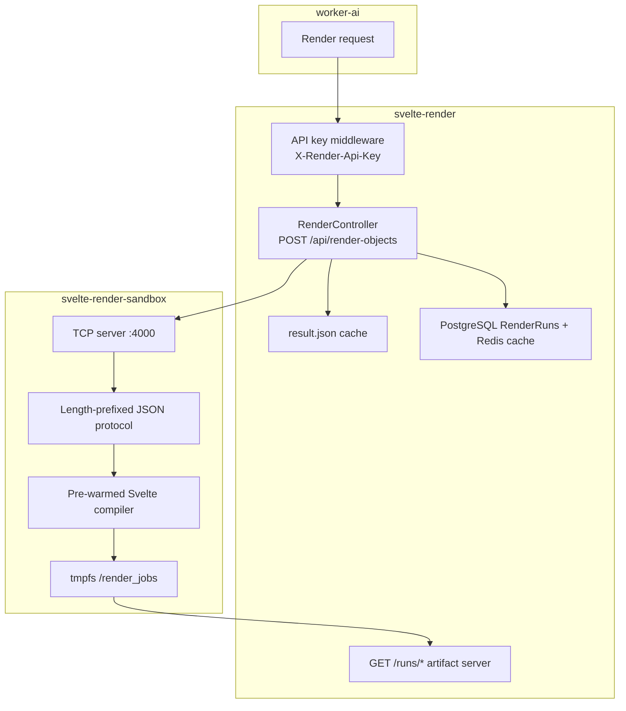
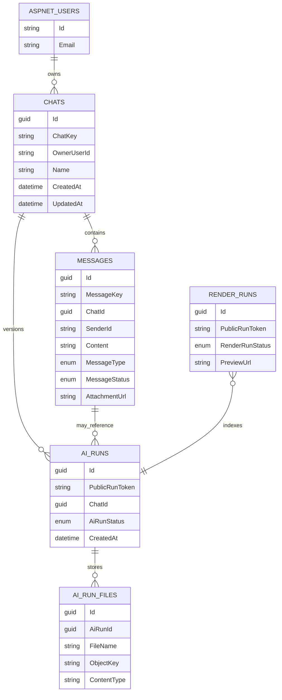
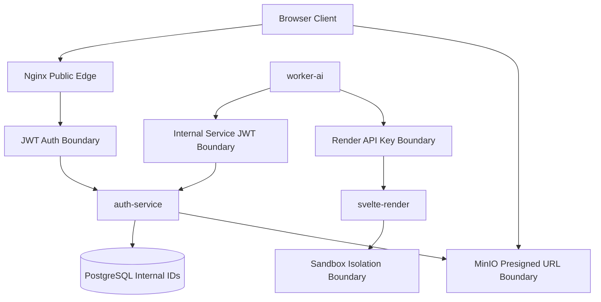
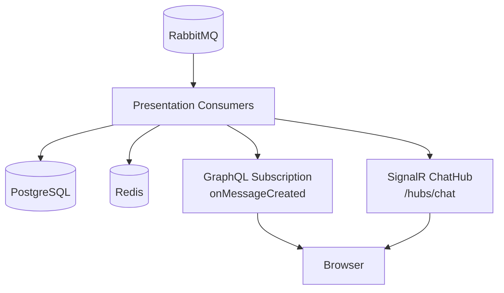

# Page.Ui: Complete Notion Documentation

> Technical disclosure: This documentation describes the current Page.Ui repository as implemented. It is written for academic evaluation by professors and technical teaching assistants, with emphasis on project goals, user workflows, architecture, implementation details, security boundaries, and operational verification.

## Table of Contents

1. [Introduction](#1-introduction)
2. [User Guide](#2-user-guide)
3. [System Design & Architecture](#3-system-design--architecture)
4. [Implementation Overview](#4-implementation-overview)
5. [Notion Sharing Instructions](#5-notion-sharing-instructions)
6. [Final Submission Checklist](#6-final-submission-checklist)

---

## 1. Introduction

### 1.1 Project Overview

Page.Ui is a prompt-to-UI backend platform. It accepts user design intent through a chat-style API, sends prompts into an AI generation workflow, stores generated UI source files, renders generated Svelte output in an isolated compiler service, and returns public preview URLs for finished UI artifacts.

The system is built as a multi-service backend rather than a single monolithic script. It combines ASP.NET Core, HotChocolate GraphQL, SignalR, PostgreSQL, Redis, RabbitMQ, MinIO, Nginx, and a hardened Node/Svelte rendering sandbox.

### 1.2 Problem Statement

Building frontend interfaces from natural language requires more than calling an AI model. A production-style system must:

- preserve chat history and iterative prompts;
- keep internal database identifiers private;
- validate user-uploaded assets before using them in prompts;
- send work to background workers without losing messages;
- receive AI callbacks safely;
- compile untrusted generated code in a constrained environment;
- provide realtime status updates to the user;
- expose stable artifact URLs for rendered results.

Page.Ui addresses these requirements through an event-driven, containerized backend architecture.

### 1.3 Project Goals

- **Prompt-based UI generation:** users create chats and send prompts that trigger generated UI outputs.
- **Realtime interaction:** GraphQL subscriptions and SignalR broadcast message and generation updates.
- **Secure rendering:** generated Svelte code is compiled by an isolated sandbox service with read-only filesystem settings, tmpfs workspaces, dropped Linux capabilities, and no-new-privileges.
- **Reliable orchestration:** EF Core, PostgreSQL, MassTransit, RabbitMQ, and the outbox pattern coordinate background work.
- **Private internal IDs:** public clients use `chatKey`, `messageKey`, and public run tokens instead of raw database GUIDs.
- **Asset support:** user uploads and AI-generated source files are stored through MinIO buckets with presigned URLs.
- **Academic clarity:** the codebase demonstrates clean layering, distributed service coordination, secure boundaries, and operational hardening.

### 1.4 Target Audience

This documentation is intended for:

- professors evaluating the project design;
- technical teaching assistants reviewing implementation quality;
- developers who need to understand the backend architecture;
- future maintainers extending the chat, AI, or render workflows.

### 1.5 Project Scope

The documented system includes:

- `Page.Ui.Presentation`: ASP.NET Core API, GraphQL, SignalR, auth-facing endpoints, upload endpoints, AI callback endpoints.
- `Page.Ui.Application`: service interfaces, chat inputs, contracts, and shared application-level abstractions.
- `Page.Ui.Domain`: chat entities, message entities, AI run entities, render run entities, enums, and opaque-key behavior.
- `Page.Ui.Infrastructure`: EF Core persistence, PostgreSQL integration, MassTransit/RabbitMQ integration, MinIO integration, Redis integration, Identity/JWT support.
- `Page.Ui.Worker.Ai`: background worker that consumes chat events, calls the external AI API, prepares internal JWTs, and triggers rendering.
- `Page.Ui.SvelteRender`: render API that compiles UI source, stores render metadata, and serves preview artifacts.
- `svelte-render-sandbox`: Node.js process that hosts the Svelte compiler behind an internal TCP protocol.
- Docker infrastructure: Nginx, PostgreSQL, Redis, RabbitMQ, MinIO, bucket initialization, service networks, and health checks.

### 1.6 Current Implementation Status

Implemented:

- chat creation through `createChat`;
- follow-up messages through `createMessage`;
- public chat/message DTOs using opaque keys;
- GraphQL queries, mutations, and subscriptions;
- SignalR chat hub;
- MinIO-backed user uploads through `/api/upload/presign`;
- AI callback upload support through `/api/ai-dev/upload/presign`;
- AI render trigger endpoint through `/api/ai-dev/render-trigger`;
- worker-generated internal JWTs for worker-to-AI calls;
- render API key protection for worker-to-render calls;
- public run previews through `/runs/{publicRunToken}/preview.html`;
- PostgreSQL render metadata plus Redis cache/index acceleration;
- Docker Compose orchestration with service health checks;
- hardened render and sandbox containers.

Partially implemented or remaining:

- the current AI API contract is documented, but validation against the production external AI API is still needed;
- end-to-end validation against a real external AI API that verifies the signed internal JWT is still needed;
- historical render-run backfill/reconciliation tooling is not complete;
- broader automated coverage for the full worker/storage/render path is still needed.

---

## 2. User Guide

### 2.1 Prerequisites

Install or prepare:

- Docker Desktop or Docker Engine with Docker Compose support.
- .NET SDK compatible with the repository target framework `net10.0`.
- A `.env` file at the repository root.
- A `secrets/` directory mounted into API and worker containers.
- Optional SMTP settings if testing registration, password reset, or email verification flows.
- Optional external AI service settings if testing the full AI generation path.

Important environment variables used by `docker-compose.yml`:

| Variable | Purpose | Default or Notes |
| --- | --- | --- |
| `DB_PASSWORD` | PostgreSQL password | defaults to `password` |
| `RABBITMQ_USER` | RabbitMQ username | defaults to `guest` |
| `RABBITMQ_PASSWORD` | RabbitMQ password | defaults to `guest` |
| `MINIO_ACCESS_KEY` | MinIO root user/access key | defaults to `minioadmin` |
| `MINIO_SECRET_KEY` | MinIO root password/secret | defaults to `minioadmin` |
| `JWT_ISSUER` | public JWT issuer | defaults to `AuthService` |
| `JWT_AUDIENCE` | public JWT audience | defaults to `AuthService` |
| `AI_MODEL_API_BASE_URL` | external AI API base URL | empty by default |
| `AI_MODEL_API_KEY` | external AI API key | empty by default |
| `AI_INTERNAL_JWT_ISSUER` | worker internal JWT issuer | defaults to `Page.Ui.Worker.Ai` |
| `AI_INTERNAL_JWT_AUDIENCE` | worker internal JWT audience | defaults to `AiModelApi` |
| `SVELTE_RENDER_API_KEY` | worker-to-render API key | has a development default |
| `SMTP_HOST`, `SMTP_PORT`, `SMTP_USERNAME`, `SMTP_PASSWORD`, `SMTP_FROM` | email delivery settings | required for email flows |

### 2.2 Start the Application

From the repository root:

```bash
docker compose up --build
```

For background mode:

```bash
docker compose up --build -d
```

Check container status:

```bash
docker compose ps
```

The main services should become healthy before testing API workflows.

### 2.3 Runtime URLs

| Surface | URL | Purpose |
| --- | --- | --- |
| API edge | `http://localhost/` | Nginx routes to `auth-service` by default |
| GraphQL | `http://localhost/graphql` or `http://localhost/graphql/` | queries, mutations, subscriptions |
| Health | `http://localhost/health` | API health through nginx |
| SignalR hub | `http://localhost/hubs/chat` | chat realtime hub |
| User upload presign | `http://localhost/api/upload/presign` | create user asset upload URLs |
| AI upload presign | `http://localhost/api/ai-dev/upload/presign` | AI callback asset/source upload URLs |
| AI render trigger | `http://localhost/api/ai-dev/render-trigger` | AI callback render request |
| Render artifact | `http://localhost/runs/{publicRunToken}/preview.html` | generated UI preview |
| RabbitMQ management | `http://localhost:15672` | queue inspection |
| MinIO console | `http://localhost:9001` | object storage inspection |

### 2.4 Quick Demo Path

1. Start the stack:

   ```bash
   docker compose up --build
   ```

2. Open GraphQL at `http://localhost/graphql`.

3. Authenticate if the schema requires a bearer token for your local flow.

4. Create a chat with an initial prompt.

5. Copy the returned `chat.chatKey`.

6. Send a follow-up message using `createMessage`.

7. Watch messages through the GraphQL subscription or SignalR hub.

8. When an `AI_RUN` message appears, open the preview URL in its content/metadata.

9. If the external AI API is not configured, expect the worker to use the normal failure/fallback path instead of producing a real AI-generated artifact.

### 2.5 Create a Chat

Use `createChat` to start a design session. Empty chats are not supported; the first prompt is required.

```graphql
mutation CreateChat {
  createChat(input: {
    name: "Dashboard concept"
    initialUserMessage: {
      content: "Design a responsive analytics dashboard with charts, filters, and a dark professional theme."
    }
  }) {
    chat {
      chatKey
      name
      modelId
      createdAt
      updatedAt
    }
    initialMessage {
      messageKey
      chatKey
      content
      type
      status
      createdAt
    }
  }
}
```

Expected result:

- a new chat owned by the authenticated user;
- a public `chatKey`;
- an initial user message;
- background events that can trigger AI/render processing.

### 2.6 Send a Follow-Up Message

Use `createMessage` with the public `chatKey`.

```graphql
mutation CreateMessage {
  createMessage(input: {
    chatKey: "paste_chat_key_here"
    content: "Make the dashboard more compact and add a left navigation rail."
  }) {
    messageKey
    chatKey
    content
    type
    status
    replyToKey
    attachmentUrl
    createdAt
  }
}
```

Message types used by the active chat/AI pipeline:

- `USER_MESSAGE`
- `AI_MESSAGE`
- `THINKING`
- `AI_RUN`

The domain enum also contains legacy/general values such as `Text`, `Image`, and `File`.

### 2.7 Rename a Chat

```graphql
mutation RenameChat {
  renameChat(input: {
    chatKey: "paste_chat_key_here"
    name: "Compact analytics dashboard"
  }) {
    chatKey
    name
    updatedAt
  }
}
```

### 2.8 Query Chats and Messages

Query one chat:

```graphql
query GetChat {
  chat(chatKey: "paste_chat_key_here") {
    chatKey
    name
    modelId
    createdAt
    updatedAt
  }
}
```

List messages:

```graphql
query GetMessages {
  messages(chatKey: "paste_chat_key_here") {
    nodes {
      messageKey
      chatKey
      title
      content
      isQuestion
      type
      status
      replyToKey
      attachmentUrl
      senderType
      createdAt
    }
    totalCount
  }
}
```

Pagination defaults:

- default page size: `20`;
- max page size: `50`.

### 2.9 Subscribe to Realtime Messages

```graphql
subscription OnMessageCreated {
  onMessageCreated(chatKey: "paste_chat_key_here") {
    messageKey
    chatKey
    title
    content
    type
    status
    replyToKey
    attachmentUrl
    senderType
    createdAt
  }
}
```

Access is checked per authenticated user. Subscription authorization is cached briefly in-process to reduce repeated database reads on hot streams.

### 2.10 Upload an Attachment

1. Request a presigned upload URL:

   ```http
   GET http://localhost/api/upload/presign?fileName=reference.png
   Authorization: Bearer <access-token>
   ```

2. Upload the file bytes to the returned `uploadUrl`:

   ```bash
   curl -X PUT "<uploadUrl>" --upload-file reference.png
   ```

3. Send a message that references the returned `downloadUrl`:

   ```graphql
   mutation CreateMessageWithAttachment {
     createMessage(input: {
       chatKey: "paste_chat_key_here"
       content: "Use this reference image as visual direction."
       attachmentUrl: "paste_download_url_here"
     }) {
       messageKey
       attachmentUrl
       content
       type
     }
   }
   ```

Attachment validation checks that:

- the URL is absolute;
- it targets `/minio/chat-uploads/...`;
- the object exists in MinIO before message persistence;
- the stored message link is normalized to a stable queryless path.

### 2.11 View Generated UI Artifacts

Final rendered UI messages are persisted as `AI_RUN`. Preview links use opaque public run tokens:

```text
http://localhost/runs/{publicRunToken}/preview.html
```

The public preview route resolves by public token instead of exposing internal user, chat, or run storage identifiers.

### 2.12 Troubleshooting

| Symptom | What to Check |
| --- | --- |
| `http://localhost/graphql` redirects or fails | Use `/graphql/`, check `nginx` and `auth-service` logs |
| API health is unhealthy | Check PostgreSQL, Redis, RabbitMQ, and MinIO health |
| Messages are saved but no AI response appears | Check `worker-ai`, RabbitMQ queues, and `AI_MODEL_API_BASE_URL` |
| External AI service fails | The worker should emit a failure `AI_MESSAGE` and use the normal fallback path |
| Upload fails | Check MinIO credentials, `chat-uploads` bucket, file size, and presigned URL expiration |
| Render fails | Check `svelte-render`, `svelte-render-sandbox`, `X-Render-Api-Key`, and sandbox logs |
| Preview URL 404s | Confirm the `AI_RUN` points to a public run token and the render service is running |
| RabbitMQ management login fails | Use configured `RABBITMQ_USER` and `RABBITMQ_PASSWORD`; defaults are `guest`/`guest` |
| MinIO console login fails | Use configured `MINIO_ACCESS_KEY` and `MINIO_SECRET_KEY`; defaults are `minioadmin`/`minioadmin` |

---

## 3. System Design & Architecture

### 3.1 High-Level System Context



### 3.2 Docker Container Topology

The stack is defined in `docker-compose.yml` and contains these services:

| Service | Role | Network |
| --- | --- | --- |
| `auth-service` | ASP.NET Core API, GraphQL, SignalR, upload/callback endpoints | `page-network` |
| `worker-ai` | background AI orchestration worker | `page-network`, `render-internal` |
| `svelte-render` | render API and artifact server | `page-network`, `render-internal` |
| `svelte-render-sandbox` | isolated Node/Svelte compiler process | `render-internal` |
| `postgres` | relational source of truth | `page-network` |
| `redis` | cache, distributed coordination, SignalR/subscription support | `page-network` |
| `rabbitmq` | message broker | `page-network` |
| `minio` | S3-compatible object storage | `page-network` |
| `create-bucket` | creates `chat-uploads` and `ai-runs` buckets | `page-network` |
| `nginx` | public edge router | `page-network`, `render-internal` |

Actual Docker networks:

- `page-network`: regular bridge network for application, state, storage, and edge services.
- `render-internal`: internal bridge network for render-boundary traffic; used by `worker-ai`, `svelte-render`, `svelte-render-sandbox`, and `nginx`.

Public access is provided by Nginx binding host port `80`; there is no separate Docker network named `public`.



### 3.3 Edge Routing and Protocols

Nginx routes public traffic:

- `/graphql/` -> `auth-service:8080`;
- `/hubs/` -> `auth-service:8080`;
- `/api/` -> `auth-service:8080`;
- `/api/render` and `/api/render-form` -> `svelte-render:8080`;
- `/runs/` -> `svelte-render:8080/runs/`;
- `/minio/` -> `minio:9000`;
- `/` -> `auth-service:8080`.



### 3.4 Clean Architecture and Project Layers

The backend follows a layered structure where domain concepts sit at the center and infrastructure/presentation depend inward.



Layer responsibilities:

- **Domain:** entities such as `Chat`, `Message`, `AiRun`, `AiRunFile`, `RenderRun`; enums such as `MessageType`, `AiRunStatus`, and `RenderRunStatus`.
- **Application:** chat inputs, service interfaces, message/render contracts, internal JWT options.
- **Infrastructure:** database context, migrations, persistence configuration, external service integrations.
- **Presentation:** GraphQL API, REST controllers, SignalR hub, realtime consumers, upload and AI callback endpoints.
- **Worker:** event consumption, AI API calling, internal JWT creation, render triggering.
- **Render:** compilation boundary, artifact generation, metadata indexing, preview serving.

### 3.5 Chat and AI Pipeline



### 3.6 Upload and Asset Flow



### 3.7 AI API Callback Contract

The external AI API receives prompts from `worker-ai`. The worker includes an internal service JWT in the `Authorization: Bearer <token>` header.

Prompt payload shape:

```json
{
  "chatId": "guid",
  "chatKey": "opaque_chat_key",
  "userStorageKey": "hex_string",
  "versionId": "guid",
  "triggerMessageId": "guid",
  "triggerMessageKey": "opaque_message_key",
  "triggerMessageContent": "user prompt"
}
```

The AI API then calls back into Page.Ui through the dedicated AI callback endpoints:

- `GET /api/ai-dev/upload/presign?userStorageKey=...&chatKey=...&versionId=...&fileName=index.html`
- `POST /api/ai-dev/render-trigger` when generated source files are ready.

The normal render path does not require the AI API to call GraphQL `createMessage` or `renameChat`. Page.Ui persists and rebroadcasts the final `AI_RUN` message after the render trigger completes.

Render-trigger payload:

```json
{
  "chatId": "guid",
  "chatKey": "opaque_chat_key",
  "replyToMessageId": "guid",
  "runId": "guid",
  "versionId": "guid",
  "userStorageKey": "hex_string",
  "files": [
    {
      "fileName": "index.html",
      "contentType": "text/html",
      "objectKey": "ai-runs/source/object/key"
    }
  ]
}
```

### 3.8 Rendering Sandbox



Sandbox hardening:

- `svelte-render-sandbox` uses `node:20-alpine`;
- runs as user `1000:1000`;
- uses `read_only: true`;
- uses tmpfs for `/tmp` and `/render_jobs`;
- drops all capabilities with `cap_drop: ALL`;
- sets `no-new-privileges:true`;
- is attached only to the internal render network;
- runs Node with `--disallow-code-generation-from-strings`.

The `svelte-render` service also uses read-only filesystem settings, tmpfs paths, `cap_drop: ALL`, and `no-new-privileges:true`, but currently runs as `user: "0:0"` in compose.

### 3.9 Data Model



Public clients should use:

- `chatKey` for chats;
- `messageKey` for messages;
- public run tokens for previews.

Internal services may still use GUIDs inside database records, worker payloads, and internal JWT claims.

### 3.10 Security Boundaries



Security controls:

- public GraphQL clients use opaque keys instead of raw GUIDs;
- chat access is owner-based;
- GraphQL subscriptions validate chat access;
- MinIO buckets are private;
- uploads and downloads use presigned URLs;
- worker-to-AI calls use signed internal JWTs;
- worker-to-render calls use `X-Render-Api-Key`;
- Nginx strips cookies from public `/runs/` artifact responses;
- render containers use read-only filesystems and tmpfs workspaces;
- render sandbox drops Linux capabilities and runs as non-root.

### 3.11 Realtime Architecture



Realtime messages are produced after persistence so clients observe durable state, not speculative state.

### 3.12 Technology Stack

| Area | Technology |
| --- | --- |
| Backend framework | ASP.NET Core targeting `net10.0` |
| GraphQL | HotChocolate `15.1.12` |
| Realtime | GraphQL subscriptions and SignalR |
| Persistence | EF Core `10.0.x`, PostgreSQL `17-alpine`, Npgsql |
| Messaging | MassTransit `8.2.5`, RabbitMQ `3-management-alpine` |
| Cache/backplane | Redis from `redis:alpine`, StackExchange.Redis |
| Object storage | MinIO |
| Render API | ASP.NET Core service in `Page.Ui.SvelteRender` |
| Sandbox compiler | Node.js `20-alpine` with Svelte compiler packages |
| Edge routing | Nginx `alpine` |
| Containerization | Docker Compose |
| Testing | xUnit, Moq, EF Core InMemory |

### 3.13 Operational Reliability

- Health checks are configured for `auth-service`, `worker-ai`, `svelte-render`, PostgreSQL, Redis, and RabbitMQ.
- `auth-service` can apply migrations on startup through `Database__ApplyMigrationsOnStartup=true`.
- `DatabaseStartupSchemaVerifier` verifies required PostgreSQL tables and columns after migrations. It does not verify trigram indexes.
- MassTransit outbox/inbox tables protect database-to-message consistency.
- RabbitMQ decouples API requests from worker execution.
- Redis supports distributed coordination, caching, and realtime scaling support.
- Render metadata is stored in PostgreSQL and accelerated through Redis.
- `create-bucket` initializes `chat-uploads` and `ai-runs` buckets.

---

## 4. Implementation Overview

### 4.1 Solution Structure

| Project | Responsibility |
| --- | --- |
| `Page.Ui.Domain` | core chat/render entities, enums, constants, opaque-key behavior |
| `Page.Ui.Application` | inputs, payloads, service contracts, event contracts, internal JWT options |
| `Page.Ui.Infrastructure` | EF Core persistence, migrations, Identity, Redis, RabbitMQ, MinIO, email |
| `Page.Ui.Presentation` | GraphQL API, REST controllers, SignalR hub, auth, realtime consumers |
| `Page.Ui.Worker.Ai` | background worker, AI model API integration, render orchestration |
| `Page.Ui.SvelteRender` | render API, artifact serving, sandbox client, render metadata |
| `Page.Ui.Backend.Tests` | backend regression and schema tests |

### 4.2 Domain Implementation

Important domain types:

- `Chat`: represents a user-owned design session.
- `Message`: stores user prompts, AI text updates, thinking updates, and final AI run messages.
- `AiRun`: represents an AI-generated UI version/run.
- `AiRunFile`: tracks files associated with an AI run.
- `RenderRun`: indexes render-service outputs and preview metadata.
- `MessageType`: includes `Text`, `Image`, `File`, `AiRun`, `UserMessage`, `AiMessage`, and `Thinking`.
- `AiRunStatus`: `Accepted`, `Thinking`, `Generating`, `UiGenerating`, `Stored`, `Rendering`, `Completed`, `Failed`.
- `RenderRunStatus`: `Succeeded`, `Failed`, `Pruned`.

Opaque key behavior protects public APIs from exposing internal database GUIDs. Public DTOs expose `chatKey` and `messageKey`; internal code can still map back to GUIDs where database operations require them.

### 4.3 API Implementation

GraphQL is implemented in `Page.Ui.Presentation`.

Queries:

- `chat(chatKey)`;
- `chats`;
- `searchChats(name)`;
- `messages(chatKey)`;
- `searchMessages(query, chatKey)`.

Mutations:

- `createChat(input)`;
- `createMessage(input)`;
- `renameChat(input)`;
- `deleteChat(chatKey)`.

Subscription:

- `onMessageCreated(chatKey)`.

REST endpoints:

- `GET /api/upload/presign`;
- `GET /api/ai-dev/upload/presign`;
- `POST /api/ai-dev/render-trigger`;
- render diagnostics/reporting endpoints as implemented in the presentation layer.

SignalR:

- `ChatHub` supports joining and leaving chat groups by `chatKey`.

### 4.4 Persistence Implementation

Persistence uses:

- EF Core as the ORM;
- PostgreSQL as the relational source of truth;
- migrations for schema changes;
- ASP.NET Identity tables for users/auth;
- MassTransit tables for outbox/inbox messaging;
- `RenderRuns` metadata for rendered artifacts.

Database startup verification:

- runs only for the PostgreSQL provider;
- verifies required tables such as `__EFMigrationsHistory`, `AiRuns`, `AiRunFiles`, and `RenderRuns`;
- verifies required `Messages` columns such as `ClientRequestId`, `Title`, and `IsQuestion`;
- fails startup if required schema elements are missing after migrations.

Search behavior:

- chat-name search uses PostgreSQL `ILIKE` with a trigram-backed migration instead of lowercasing both sides with `ToLower().Contains(...)`.

### 4.5 Messaging Implementation

Messaging uses:

- MassTransit;
- RabbitMQ;
- EF outbox/inbox persistence.

The API writes messages and outbox rows in the same transactional flow. RabbitMQ receives events after commit, which prevents clients/workers from processing messages that were not durably saved.

Core event behavior:

- user prompt saved;
- `ChatMessageCreated` published;
- realtime consumers broadcast the message;
- worker consumes the event;
- worker calls AI/render services;
- final AI/render result is persisted and broadcast.

### 4.6 Worker Implementation

`Page.Ui.Worker.Ai` is responsible for background AI orchestration.

It:

- consumes chat/message events from RabbitMQ;
- applies short AI rate limits through Redis-backed coordination;
- builds a prompt payload for the external AI API;
- signs an internal JWT for worker-to-AI trust;
- sends `POST /generate` to the configured external AI API;
- handles cases where the AI API is unavailable;
- emits failure `AI_MESSAGE` and fallback `AI_RUN` behavior when needed;
- consumes render-trigger work;
- calls `svelte-render` with `X-Render-Api-Key`.

Internal JWT claims include values such as:

- `sub`: `worker-ai`;
- `user_id`;
- `chat_id`;
- `message_id`;
- issuer from `InternalServiceJwt__Issuer`;
- audience from `InternalServiceJwt__Audience`.

### 4.7 AI Callback Implementation

The AI service is expected to:

1. receive a prompt from `worker-ai`;
2. immediately return `202 Accepted` or equivalent non-blocking acceptance;
3. upload generated UI files through `/api/ai-dev/upload/presign`;
4. call `/api/ai-dev/render-trigger` when files are ready to compile.

Callback authorization uses the internal JWT that the worker sent to the AI API. The token binds the callback to a specific user, chat, and trigger message.

### 4.8 Render Implementation

`Page.Ui.SvelteRender` exposes:

- `POST /api/render-objects`;
- `POST /api/render-form`;
- `GET /runs/*`.

The render endpoint:

- validates `X-Render-Api-Key`;
- receives render input/source metadata;
- computes or resolves render identity;
- stores raw input files under each run;
- calls the Node sandbox over TCP;
- writes compiled HTML/CSS/JS artifacts;
- stores result metadata;
- returns preview URLs.

Generated artifacts include:

- `preview.html` for backward-compatible preview access;
- `artifacts/client.js`;
- `artifacts/client.css`;
- `result.json`;
- raw `input/` files for traceability.

### 4.9 Sandbox Implementation

`svelte-render-sandbox` is a persistent Node process.

It:

- starts from `Page.Ui.SvelteRender/Dockerfile.sandbox`;
- uses `node:20-alpine`;
- starts `/app/NodeWorker/runner.js`;
- listens on port `4000`;
- receives length-prefixed JSON over TCP;
- preloads compiler modules for lower render latency;
- uses `/render_jobs` tmpfs for temporary work;
- returns compiled output to the render service.

### 4.10 Performance Implementation

Performance-related choices:

- compiler modules are pre-warmed in the sandbox;
- GraphQL connection page sizes are bounded;
- HotChocolate cost limits are enabled with max field/type cost `5,000`;
- Redis accelerates realtime and render metadata access;
- PostgreSQL remains the source of truth;
- RabbitMQ keeps slow AI/render work outside request-response latency;
- Nginx enables gzip for common text and API response types.

### 4.11 Security Implementation

Security-related choices:

- JWT authentication protects user GraphQL/API operations;
- chat authorization is owner-based;
- public GraphQL DTOs hide internal chat/message IDs;
- internal AI callbacks are validated through internal JWTs;
- render service calls require `X-Render-Api-Key`;
- MinIO buckets are private and use presigned access;
- `chat-uploads` stores user assets;
- `ai-runs` stores generated source files;
- render/sandbox containers use read-only filesystems and tmpfs;
- sandbox runs non-root and drops capabilities;
- Nginx hides `Set-Cookie` and clears cookies for `/runs/` public artifacts.

### 4.12 Testing and Verification

Automated test tooling:

- `Page.Ui.Backend.Tests`;
- xUnit;
- Moq;
- EF Core InMemory;
- Microsoft.NET.Test.Sdk;
- coverlet collector.

Recommended verification commands:

```bash
dotnet test
```

```bash
docker compose up --build
```

```bash
docker compose ps
```

Manual verification scenarios:

- create a user/authenticated API context;
- run `createChat`;
- verify returned `chatKey`;
- run `createMessage`;
- verify message subscription emits events;
- upload an attachment through MinIO presign flow;
- confirm invalid attachment URLs are rejected;
- trigger AI flow with a configured AI API;
- verify AI callbacks create `THINKING`, `AI_MESSAGE`, and `AI_RUN` messages;
- open `/runs/{publicRunToken}/preview.html`;
- stop external AI API and verify fallback behavior.

### 4.13 Known Limitations and Risks

- A real external AI API integration still needs final end-to-end validation.
- The current AI API wire contract may continue to evolve as production integration hardens.
- More automated coverage is needed for worker/storage/render integration.
- Historical render-run reconciliation tooling is not complete.
- The render service container currently runs as root in compose even though it uses other hardening controls; the sandbox compiler itself runs non-root.
- Notion Mermaid rendering should be checked after import because long diagrams may need manual preview toggling.

---
