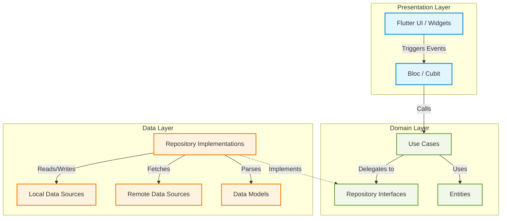
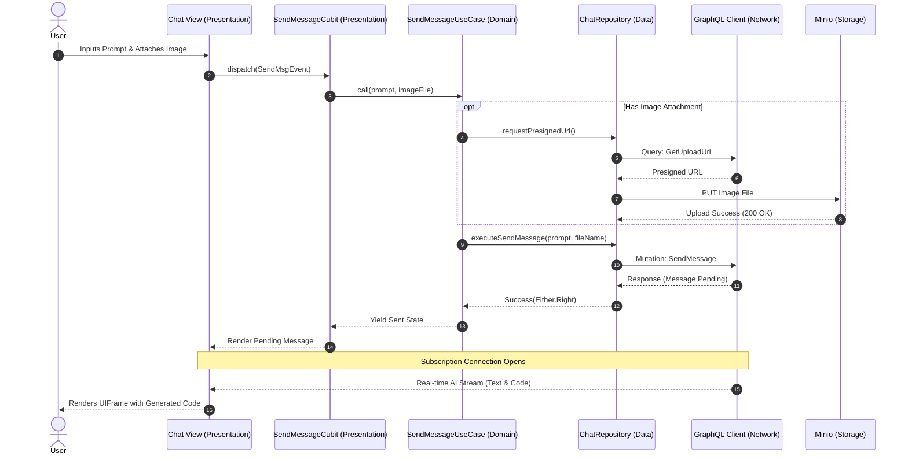

# Page UI

## Overview
**Page UI** is an advanced, high-performance Flutter web application engineered to generate dynamic user interfaces through interactive AI-driven chat. Designed with precision for creative professionals and developers, it bridges the gap between natural language prompts and functional UI components.

The platform emphasizes a sophisticated, immersive user experience with seamless real-time data synchronization, robust state management, and a strict adherence to **Clean Architecture** principles.

---

## 🎯 Key Features

### 1. Interactive AI Chat & UI Generation
- **Intelligent Prompting:** Users can generate functional UI layouts by sending natural language prompts directly in the chat.
- **Real-Time Subscriptions:** Built on `graphql_flutter` with WebSocket connections for instant message delivery and live AI responses.
- **Media Attachments:** Support for complex media uploads via presigned URLs to secure Minio storage buckets.
- **Live Previews (UIFrame):** An embedded HTML iframe (`HtmlElementView`) that instantly renders the AI-generated interface directly alongside the conversation.

### 2. Comprehensive Authentication System
- End-to-end security workflows including Registration, Login, Email Verification, and Password Reset.
- Secure, persistent session management via JWT tokens (Access and Refresh tokens) stored securely.

### 3. Sophisticated Onboarding & Navigation
- Interactive, animated splash screens utilizing `animated_text_kit`.
- Intelligent routing and deep-linking handled via `go_router`.
- Native web interoperability allowing external links to open safely in new browser tabs.

---

## 🏗️ System Architecture

The project is strictly structured using **Clean Architecture** to ensure high maintainability, testability, and separation of concerns.



### Layer Breakdown
1. **Presentation (`presentation/`)**: Exclusively handles UI rendering and user interactions. Features zero business logic, delegating state orchestration entirely to `Cubit`.
2. **Domain (`domain/`)**: The core of the application. Contains isolated business logic (`UseCases`), business objects (`Entities`), and data contracts (`Repositories`). Entirely independent of Flutter or external packages.
3. **Data (`data/`)**: Manages the integration with the outside world. Implements repository contracts, processes JSON serialization via `Models`, and handles API communication and caching.

---

## 📦 Technology Stack & Packages

| Category | Technology / Package | Purpose |
| :--- | :--- | :--- |
| **Framework** | Flutter `sdk: ^3.10.4` | Core UI Toolkit (Web Target) |
| **State Management** | `flutter_bloc` | Predictable state container and Cubit implementation |
| **Networking** | `graphql_flutter`, `dio` | GraphQL queries/mutations/subscriptions & REST calls |
| **Routing** | `go_router` | Declarative, URL-based routing architecture |
| **Dependency Injection** | `get_it` | Centralized service locator for decoupled dependencies |
| **Local Persistence** | `hive`, `flutter_secure_storage` | Fast NoSQL caching and secure token storage |
| **Error Handling** | `dartz` | Functional programming paradigms (`Either` pattern) |
| **UI & Animations** | `skeletonizer`, `animated_text_kit` | Premium loading states and text animations |
| **Web Interop** | `web`, `pointer_interceptor` | Native browser API access and iframe gesture handling |

---

## 🔄 Interaction Flow: Message Sending & UI Generation

The following diagram illustrates the formal execution sequence when a user requests a new UI generation via chat.



---

## 📂 Project Structure

```text
lib/
├── config/              # Application routing (GoRouter) and global Themes
├── core/                # Shared infrastructure across all modules
│   ├── constants/       # Global endpoints, UI constants, styling tokens
│   ├── database/        # GraphQL configs, API interceptors, Hive setup
│   ├── errors/          # Global Failure and Exception definitions (dartz)
│   ├── helpers/         # DI setup (GetIt), Loggers, Web interoperability
│   ├── network/         # Internet connectivity monitoring
│   └── widgets/         # Highly reusable, atomic UI components
└── features/            # Isolated Feature Modules
    ├── auth/            # Registration, Login, Token management
    ├── chat/            # Chat history, UIFrame rendering, Message dispatch
    └── intro_screens/   # Splash animations, routing resolution
```

---

## 🚀 Getting Started

### Prerequisites
- **Flutter SDK**: Version `3.10.4` or higher.
- **Target Platform**: Optimized for Google Chrome (Web).

### Installation & Execution

1. **Fetch Dependencies:**
   ```bash
   flutter pub get
   ```

2. **Run the Application:**
   ```bash
   flutter run -d chrome
   ```

### Code Quality & Testing
Page UI enforces strict engineering standards. Before committing, ensure all static analysis checks and tests pass.

```bash
# Run strict Dart analysis
flutter analyze

# Execute Domain and Data layer unit tests
flutter test
```

---

## 📜 Engineering Guidelines
This project adheres to stringent internal rules (`ai.md`):
1. **Strict Clean Architecture:** No business logic in the UI. Errors propagate cleanly via `Either<Failure, Success>`.
2. **Performance Awareness:** Const constructors are mandated. `setState` is strictly limited to local ephemeral UI state; all feature states are managed by Cubits.
3. **Immutability & Safety:** Null safety is enforced. Silent failures are prohibited.
4. **Dart 3.0 Paradigms:** Utilization of `sealed classes`, pattern matching, and native records over heavy code-generation plugins (like Freezed).

---

*Page.ui - Creativity Without Limits. Private project. All rights reserved.*
